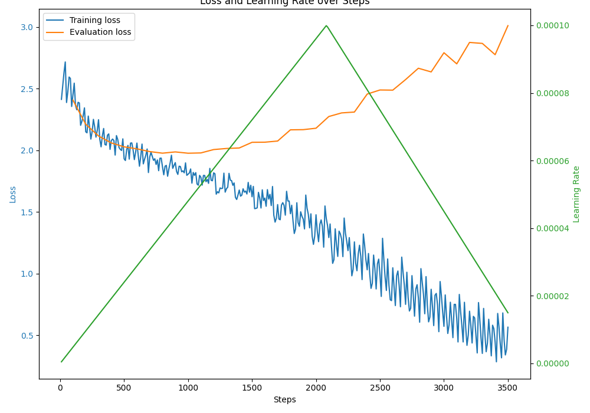

# 一个简单的可商用的LLM微调项目

> 虽然复现和开源通用LLM很有意思，但没卡没数据没人力的我就做做简单的LLM微调吧
>
> 主要学习用，商用也行但是数据要自己生成，数据生成参考这个仓库：https://github.com/morning-hao/domain-self-instruct

# 一、安装环境

```bash
conda create -n domain-bloom python=3.10
conda activate domain-bloom
pip install torch==1.13.1+cu116 torchvision==0.14.1+cu116 torchaudio==0.13.1 --extra-index-url https://download.pytorch.org/whl/cu116
pip install -r requirements.txt
```

# 二、配置

 [Bloom_config.json](run_config/Bloom_config.json) 

```json
{
    。。。
    "model_name_or_path": "/xxx/bloomz-7b1-mt",  # 这个是重点，下载模型后改成自己的原始模型路径
	。。。

}
```

# 三、训练

```bash
python finetune.py --model_config_file run_config/Bloom_config.json --lora_hyperparams_file run_config/lora_hyperparams_bloom.json  --use_lora
```

# 四、预测

```bash
# 预测测试集，测试数据在./data_dir/domain.test.json
python generate_test.py --dev_file ./data_dir/domain.test.json --model_name_or_path /xxx/bloomz-7b1-mt  --lora_weights trained_models/xxx/

# 本地流式预测
python generate_stream_local.py --model_name_or_path /xx/bloomz-xx --lora_weights trained_models/xx/
```

> 流式示例
>
> 

# 五、画图

```bash
python plot_loss.py --json_file ./trained_models/xx/checkpoint-xx/trainer_state.json
```

# 六、结果总结


1. 3b的模型相比于560m的能拟合的更深，两个模型都能过拟合到训练数据上，虽然测试loss变高了但是风格和内容没有变差
2. 4090的lora训练3b模型1500条左右数据充分拟合耗时近1.5h，训练560m耗时近30min
3. 集外数据胡说八道

## 1.训练过程

> bloomz-3b训练过程
>
> 
>
> bloomz-560m训练过程
>
> 

## 2.预测效果

> [predictions_bloomz_3b.json](output_dir/predictions_bloomz_3b.json) 
>
> ```json
> [
>     {
>         "input": "用户:孩子总是不肯按时吃饭，吃的东西也很挑剔，有什么好的方法可以帮助他养成良好的饮食习惯呢？\n\n助手:",
>         "predict": "孩子不按时吃饭并且挑剔，可能与其饮食习惯或饮食偏好有问题。为了帮助孩子养成良好的饮食习惯，可以从以下几个方面入手：\n\n1. 制定合理的饮食计划，让孩子有规律的饮食时间和安全感的食物。\n\n2. 培养孩子的饮食兴趣，例如带孩子参加美食节或去餐厅就餐。\n\n3. 适当引导孩子选择健康食品，例如减少糖分和脂肪摄入，多吃蔬菜和水果等。\n\n4. 注意孩子的情绪和身体状况，及时与医生沟通，避免因情绪波动或身体不适而影响食欲。\n\n5. 父母要以身作则，让孩子看到父母有规律的饮食习惯，养成健康的生活习惯。\n\n总之，帮助孩子养成良好的饮食习惯需要家长的耐心和关注，通过以上几个方面的努力，可以帮助孩子养成健康的饮食习惯，增强孩子的自尊心和自信心。",
>         "target": "孩子不按时吃饭并且挑剔，可能涉及到孩子的饮食偏好和饮食习惯。一种有效的方法是在定点时间和地点供应食物，例如每天固定的早、中、晚餐。此外，提供孩子丰富的食物种类，让孩子参与到食物准备和烹饪过程中，激发他们的食欲和好奇心。同时，要避免提供过多的糖类和脂肪类食物，适当引导孩子吃更健康和营养均衡的食物。最后，积极和孩子沟通，让他们理解为什么需要保持健康的饮食习惯，并给予他们鼓励和正面反馈。"
>     },
>     {
>         "input": "用户:孩子在学习方面比同龄人要差很多，但他又不愿意听建议去补习，这应该怎么办？\n\n助手:",
>         "predict": "首先，作为家长应该和孩子好好沟通，了解他为何不愿意去补习。也许是因为他对补习班感到不自在或没有信心，或者需要更多的个人空间和自由时间。如果您了解了孩子的想法，可以尝试提供更适合他的学习方式和环境，比如私人导师或网络教育平台。同时，也可以让孩子了解没有克服困难就无法取得成功的事实，并向他展示成功人士的成功故事。最重要的是，不要强迫孩子去学习，而是在适当的情况下给予鼓励和支持，让孩子自己发现学习的意义和乐趣。",
>         "target": "首先，作为家长应该和孩子好好沟通，了解他为何不愿意去补习。也许是因为他对补习班感到不自在或没有信心，或者需要更多的个人空间和自由时间。如果您了解了孩子的想法，可以尝试提供更适合他的学习方式和环境，比如私人导师或网络教育平台。同时，也可以让孩子了解没有克服困难就无法取得成功的事实，并向他展示成功人士的成功故事。最重要的是，不要强迫孩子去学习，而是在适当的情况下给予鼓励和支持，让孩子自己发现学习的意义和乐趣。"
>     },
> ```
>
>  [predictions_bloomz_560m.json](output_dir/predictions_bloomz_560m.json) 
>
> ```json
> [
>     {
>         "input": "用户:孩子总是不肯按时吃饭，吃的东西也很挑剔，有什么好的方法可以帮助他养成良好的饮食习惯呢？\n\n助手:",
>         "predict": "孩子不按时吃饭和挑剔的饮食习惯，可能是由于饮食不健康引起的。为了帮助孩子养成良好的饮食习惯，可以从以下几个方面入手：\n\n1. 制定合理的饮食计划，让孩子了解食物的种类和成分，避免挑剔。\n\n2. 给孩子提供多样化的食品，让孩子选择自己喜欢的食品，避免挑剔。\n\n3. 培养孩子对食物的兴趣，让孩子参与到食物的挑选和烹饪中，避免挑剔。\n\n4. 鼓励孩子多喝水，保持饮食的规律性。\n\n5. 在孩子吃东西时，不要使用评判性的语气，要以赞美性的语气来鼓励孩子，帮助孩子养成良好的饮食习惯。\n\n总之，要帮助孩子养成良好的饮食习惯，需要从多个方面入手，让孩子在健康饮食的道路上越走越远。",
>         "target": "孩子不按时吃饭并且挑剔，可能涉及到孩子的饮食偏好和饮食习惯。一种有效的方法是在定点时间和地点供应食物，例如每天固定的早、中、晚餐。此外，提供孩子丰富的食物种类，让孩子参与到食物准备和烹饪过程中，激发他们的食欲和好奇心。同时，要避免提供过多的糖类和脂肪类食物，适当引导孩子吃更健康和营养均衡的食物。最后，积极和孩子沟通，让他们理解为什么需要保持健康的饮食习惯，并给予他们鼓励和正面反馈。"
>     },
>     {
>         "input": "用户:孩子在学习方面比同龄人要差很多，但他又不愿意听建议去补习，这应该怎么办？\n\n助手:",
>         "predict": "孩子在学习方面比同龄人要差，但又不愿意听建议去补习，这可能是由于缺乏自信或焦虑。建议家长和孩子一起沟通，了解孩子的学习情况和兴趣爱好，帮助孩子找到适合自己的学习方式和学习方法。同时，家长也应该给予孩子足够的鼓励和支持，让孩子知道自己能够取得成功，不要轻易放弃。最重要的是，家长应该尊重孩子的选择，不要强求孩子，给予适当的自主权。",
>         "target": "首先，作为家长应该和孩子好好沟通，了解他为何不愿意去补习。也许是因为他对补习班感到不自在或没有信心，或者需要更多的个人空间和自由时间。如果您了解了孩子的想法，可以尝试提供更适合他的学习方式和环境，比如私人导师或网络教育平台。同时，也可以让孩子了解没有克服困难就无法取得成功的事实，并向他展示成功人士的成功故事。最重要的是，不要强迫孩子去学习，而是在适当的情况下给予鼓励和支持，让孩子自己发现学习的意义和乐趣。"
>     },
> ```
